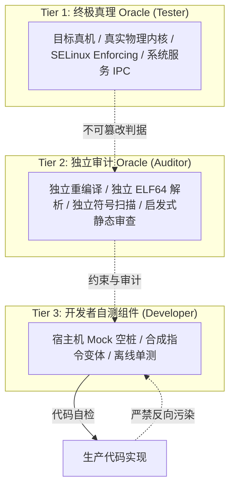

# Respect the Oracle：测试基准守则与防反向过拟合

本技能源自 [`chris-short/respect-the-oracle`](https://github.com/chris-short/respect-the-oracle) 理念，旨在约束 Agent 在软件开发、构建与自检循环中的行为，杜绝“为过测而篡改用例”、“自造 Mock 规则绑架生产代码”及“虚假测试置信度”等典型失效模式。

在内核与系统级开发（如 KPM）中，测试环境与真实目标硬件存在显著代差。Agent 必须严格遵守以下四项核心约束准则：

---

## 核心准则

### 1. 测试基准不可篡改（Oracle Immutability）
- **测试是规范，不是橡皮泥**：已随候选提交、版本发布归档的测试套件（例如指令宏回归、FIFO 队列选择、多内核语料参考输出）属于**权威基准（Oracle）**。
- **只许追加，严禁删改**：在修复问题或增加特性时，Agent 只能**追加**新的测试用例，严禁私自修改、注释掉、放宽或删除已有测试用例中的断言。
- **代码服从测试**：当测试红灯时，首先假定是生产代码实现有误，任务是修改代码使其满足测试，而不是修改测试来迁就未达标的代码。

### 2. 严禁反向架构污染（No Inverse Overfitting / Mock Pleasing）
- **内核生产代码高于宿主测试**：内核 C 代码的设计依据是 Linux 内核与 Android 原生契约（锁顺序、原子上下文、驱动生命周期、内存保护）。
- **严禁为单测牺牲生产代码结构**：
  - 严禁为了迁就 Darwin/Linux 宿主机单元测试或 Mock 框架的便利性，在生产内核模块中增加不必要的局部暂存变量、多余的临时字段或扭曲控制流；
  - 严禁在生产代码中实现脱离内核真实运行事实的虚假语义（例如：内核初始化推导一旦失败，驱动便直接终止并卸载模块，严禁在生产函数中为了满足单测断言而专门实现不必要的字段回滚暂存）。

### 3. 断言变更受控协议（Oracle Change Protocol）
- **不可隐蔽削弱断言**：如果某个已有测试断言被证实确实存在逻辑缺陷或脱离真实内核契约（例如此前 AUD-005 中脱离实际的全字段回滚断言）：
  1. **禁止隐蔽混入**：严禁将“断言修改/删除”与业务功能实现混在同一个提交中；
  2. **强制独立说明**：必须在开发报告中单独列出「断言调整范围与技术依据」，详细阐述原断言为何失真、修改后如何避免引入回归；
  3. **强制独立复核**：断言放宽与变更必须提交给 **Auditor（独立审计角色）** 独立复核，Developer 不得自行关闭或单方面宣布合规。

### 4. 严守三层置信度天梯（Three-Tier Oracle Hierarchy）
测试通过率不等于系统安全性。在编写开发自检报告时，Agent 严禁以“自测 100% 通过”替代安全结论，必须明确所使用的测试处于哪一层级：

- **Tier-3（最低，Developer 宿主自测）**：
  - 宿主机 Mock 空桩、内存与锁模拟、合成 NOP 注入负例；
  - **置信度**：仅能证明基础语法与简单逻辑路径无明显崩溃，**无法证明真实内核并发安全性与跨机型泛化能力**。
- **Tier-2（中等，Auditor 独立审计）**：
  - 隔离沙箱无缓存重编译、独立二进制 ELF 节区自解析、KernelPatch 导出表比对；
  - **置信度**：证明产物完全可复现、二进制接口合规、无未授权越界风险。
- **Tier-1（终极，Tester 真机测试）**：
  - 真实物理机型、真实 Linux 内核、SELinux Enforcing、UID 1000 进程真实通信、高频 IPC 压力测试；
  - **置信度**：**唯有真机事实才是最终交付验收的终极 Oracle**。
